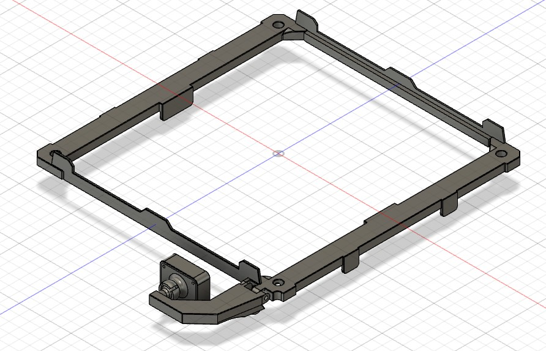
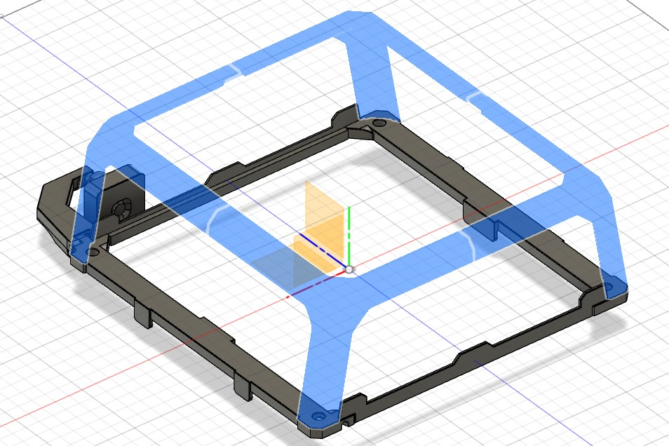
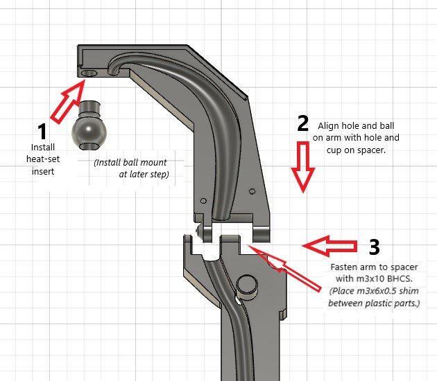
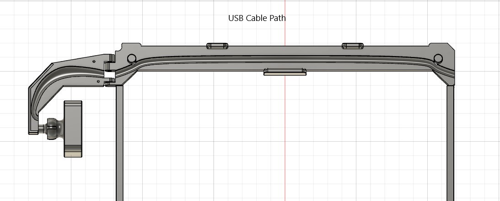
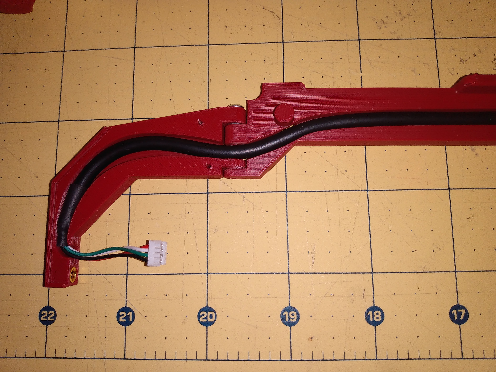
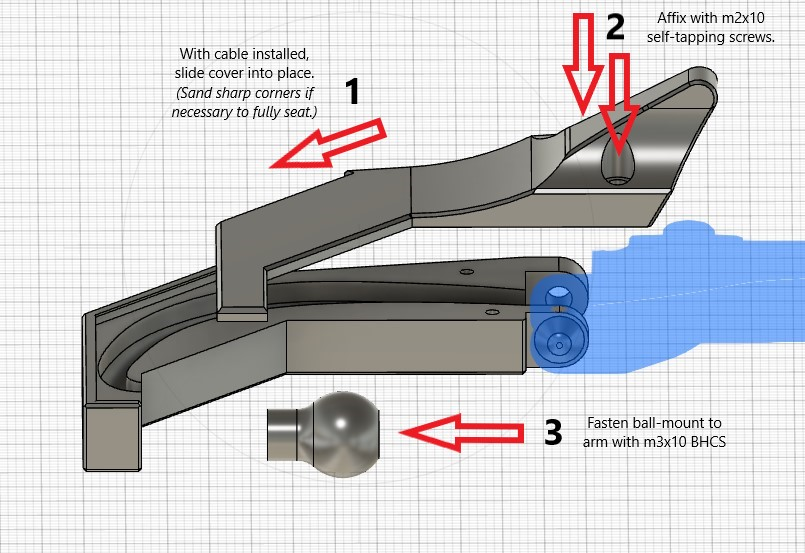
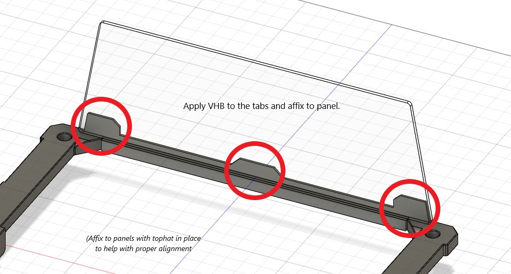
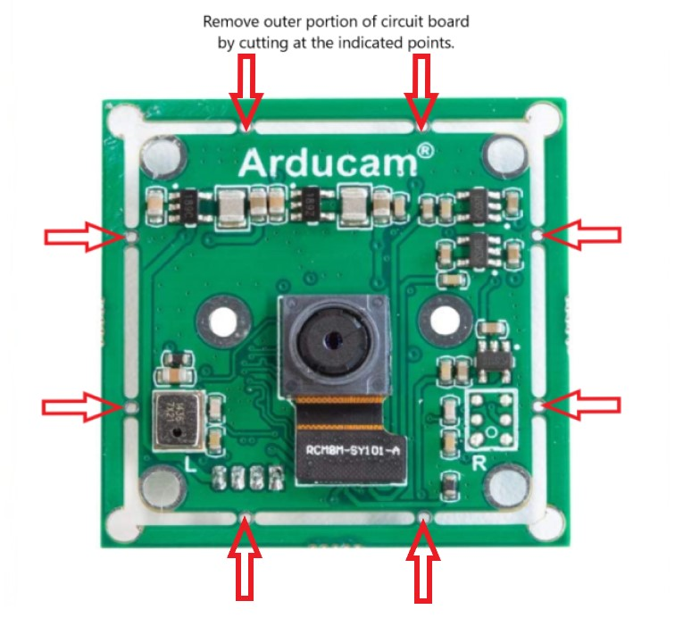
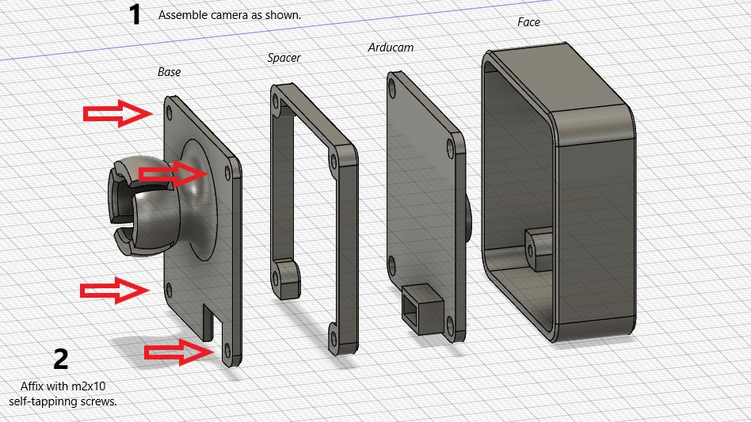
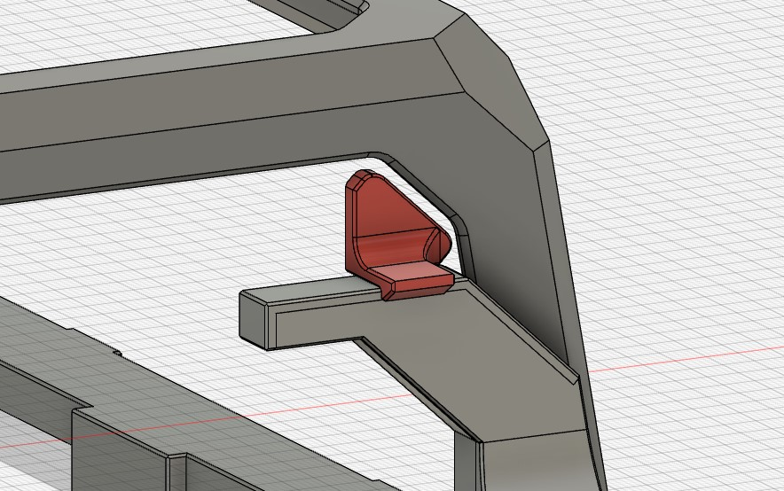

# TopHat Cam Extension for V0/0.1

 A tophat extension that adds 7mm in height and a webcam below the tophat.
 It does not require replacing any parts on the tophat itself and can be considered a "drop-in" modification.
 
 The camera housing is designed around the [Arducam USB Camera Module with 8MP Sony IMX219](https://www.uctronics.com/download/Amazon/B0196.pdf)
 
 
 
## BOM
 - (1) [Arducam USB Camera Module](https://www.arducam.com/product/b0196arducam-8mp-1080p-usb-camera-module-1-4-cmos-imx219-mini-uvc-usb2-0-webcam-board-with-1-64ft-0-5m-usb-cable-for-windows-linux-android-and-mac-os/) (Also available on Amazon)
 - (1) m3x5x4 heatset insert
 - (2) m3x10 BHCS
 - (1) m3x6x0.5 shim
 - (6) m2x10 self-tapping screws
 - VHB tape

# Directions
 
## A. Print the parts
 The parts for this mod should be printed with standard Voron quality settings.  It is assumed that they will be printed
 on a Voron V0 or V0.1.  All parts in the top-level STLs folder can be printed on the 120x120 bed.  The _Spacer_ parts have been split from the CAD
 in order to accomodate this. They will still need to be rotated 45 degrees to fit.  (It is suggested to set the infill angle to 90 degrees to print the rotated parts.)
 
 If you have a larger printer, the un-split parts are available in the STLs/Optional folder.
 
 If you don't care about the camera and just want the spacers, the right spacer parts without the camera stuff are also in Optional folder.
 
## B.  Prepare the camera arm and attach to right spacer.
 
 
 
## C.  Install the USB cable in the cable path
 
 
 
 Note: Place the end of the cable as far forward as possible.  You might want to cut away the heatshrink on the end to help seat  it better.
 Notice the position of the cable in the curved portion of the path - this is intended to provide some strain-reliev when the camera
 arm is folded down.
 
 

## D.  Install the arm cover and ball mount.
 
 

## E.  Install the left and right spacers.
 Keeping the cable in the tunnel, flip the right spacer(s) and arm assembly over and press down on the top extrusion until
 the tabs "click" into place.  Install the left spacer(s) similarly.
 
## F.  Instll the front and rear spacers.
 Place the tophat in place on the left/right spacers and intall the front/rear spacers.  It will help to open the door and remove the back panel for this step.
 Hint for split spacers. Apply VHB across seam before attaching to panel. (Be careful that each panel rests firmly on the shelf of the spacer.)
 
 
 
## G.  Prepare the Arducam and assemble the camera case.
 Cut away the outer portion of the PCB (as close to the inner PCB as possible).
 
 
 
 
 
## H.  Install camera assembly.
 Plug the USB cable into the camera and attach camera base to ball mount. (Note: If the base seems too loose, you may want to scale up the ball mount a bit and reprint.
 A little loose is OK, because the camera will probably be tilted all the way down for best image position.)
 
## Optional
 Included in the Optional folder is Arm_Catch.stl.  This part is designed to hold the arm in place in the folded-up position.
 To install, apply some VHB and hold it on the camera arm as you fold it up to affix it to panel.
 
 
 
 